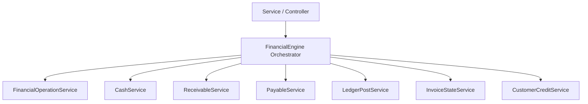

# وثيقة التصميم المعماري للنواة المالية (FAC-001)

هذه الوثيقة تحدد التصميم الهيكلي والتفصيلي لـ **المحرك المالي (Financial Engine)** في نظام **HWNix ERP**، وتعتبر المرجع النهائي للتنفيذ البرمجي للامتثال لـ 16 قاعدة ذهبية للنواة المالية.

---

## 🏗️ 1) الهيكل العام ونمط التنسيق (Orchestrator Pattern)

لتفادي تحويل المحرك المالي إلى "God Class" يحتوي على آلاف الأسطر، يعتمد التصميم على نمط التنسيق (Orchestrator). يكون `FinancialEngine` هو نقطة الدخول الوحيدة (Gateway) لكافة العمليات المالية، ولكنه يفوض العمل برمجياً إلى خدمات صغيرة متخصصة ذات مسؤولية واحدة (Single Responsibility):



### الخدمات الفرعية للنواة:
1. **`FinancialOperationService`**: مسؤول عن إنشاء وحفظ وعكس العمليات المالية (`FinancialOperation`).
2. **`CashService`**: مسؤول عن أرصدة وحركات الخزن وصناديق النقدية بالـ `lockForUpdate`.
3. **`ReceivableService`**: مسؤول عن أرصدة وحركات ذمم العملاء (`receivable`).
4. **`PayableService`**: مسؤول عن أرصدة وحركات ذمم الموردين (`payable`).
5. **`LedgerPostService`**: مسؤول عن القيود المزدوجة والأستاذ العام (`financial_ledgers`).
6. **`InvoiceStateService`**: مسؤول عن حساب وتحديث مدفوع ومتبقي وحالة الفاتورة الأم تلقائياً.
7. **`CustomerCreditService`**: مسؤول عن أرصدة وحركات الرصيد الدائن للعملاء عند الدفع الزائد.

---

## 🔄 2) العملية المالية كأصل (Financial Operation First)

أي أثر مالي يبدأ بإنشاء سجل `FinancialOperation` برقم معرف فريد (UUID) يعمل كـ **Idempotency Key**. ترتبط جميع السجلات الأخرى (قيود، حركات خزن، دفعات، حركات ذمم) بهذا المعرف الفريد.

### هيكل الكلاسات والعلاقات:
* `FinancialOperation` يملك علاقة `hasMany` مع كل من:
  * `FinancialLedger` (قيود الأستاذ)
  * `Transaction` (حركات الخزينة والذمم)
  * `InvoicePayment` (دفعات الفواتير)
  * `CustomerCreditTransaction` (حركات أرصدة العملاء)

---

## 🔒 3) القواعد غير القابلة للكسر (Invariants Layer)

يحتوي المحرك المالي في طبقته التأسيسية على مشغلات تحقق (Assertions) تمنع كسر القوانين الحسابية مهما كانت المدخلات، وترمي استثناءً فورياً (`FinancialInvariantException`) يتسبب في تراجع الـ DB Transaction بالكامل:

```php
class FinancialInvariants
{
    public static function assertInvoiceBalances(float $paidAmount, float $netAmount, float $creditApplied): void
    {
        if ($paidAmount < 0) {
            throw new FinancialInvariantException("لا يمكن أن يصبح المدفوع سالباً.");
        }
        if ($paidAmount > $netAmount && $creditApplied <= 0) {
            // الدفع الزائد يجب أن يولد رصيد دائن
            throw new FinancialInvariantException("لا يمكن أن يتجاوز مجموع المدفوعات صافي الفاتورة دون إنشاء رصيد دائن للعميل.");
        }
    }

    public static function assertCashBalance(float $balanceBefore, float $amount, float $balanceAfter, string $direction): void
    {
        $expected = $direction === 'deposit' ? ($balanceBefore + $amount) : ($balanceBefore - $amount);
        if (bccomp((string)$balanceAfter, (string)$expected, 2) !== 0) {
            throw new FinancialInvariantException("عدم تطابق في رصيد الخزنة المحسوب.");
        }
    }
}
```

---

## 🚀 4) العمليات المالية المجردة (Domain Business Operations)

تنسق النواة الحركات المالية بناءً على **العملية المالية المطلوبة** وليس المستند:

### أ) العملية: إنشاء فاتورة بيع / خدمة (`executeSaleInvoiceCreation`)
1. إنشاء سجل `FinancialOperation` بنوع `invoice_sale_creation` وحالة `active`.
2. استدعاء `ReceivableService::addReceivable` لزيادة ذمة العميل بالصافي وتوثيق الحركة بالعملية.
3. استدعاء `LedgerPostService::postSale` لترحيل قيد المبيعات (مدين: ذمم، دائن: إيرادات).
4. إذا كان هناك مدفوع مقدم (`paid_amount > 0`):
   * استدعاء `CashService::deposit` لشحن الخزنة بالمدفوع.
   * استدعاء `ReceivableService::reduceReceivable` لتقليل مديونية العميل بالمدفوع.
   * استدعاء `InvoiceStateService::recordPayment` لإنشاء أسطر الدفع التابعة للعملية وتحديث حالة الفاتورة.
   * استدعاء `LedgerPostService::postPayment` لترحيل القيد (مدين: نقدية، دائن: ذمم عملاء).

### ب) العملية: عكس فاتورة بيع (`executeSaleInvoiceReversal`)
1. التحقق من أن العملية الأصلية غير ملغاة مسبقاً (Invariant).
2. إنشاء سجل `FinancialOperation` بنوع `invoice_sale_reversal` مربوط بالعملية الأصلية.
3. استدعاء `ReceivableService::reduceReceivable` بقيمة صافي الفاتورة الأصلية (عكس المديونية).
4. إذا كان هناك مبالغ مقبوضة بالفاتورة:
   * استدعاء `CashService::withdraw` لسحب المبالغ من الخزنة بقفل Database.
   * استدعاء `ReceivableService::addReceivable` لإعادة ذمة العميل كما كانت.
   * استدعاء `InvoiceStateService::cancelPayments` لتصفير دفعات الفاتورة وتحديث حالتها إلى `canceled`.
5. ترحيل قيود عكسية بالكامل في الأستاذ العام مربوطة بالعملية الجديدة.

### ج) العملية: تحصيل دفعة / قسط (`executePaymentReceipt`)
1. التحقق من عدم تكرار العملية بفضل الـ **Idempotency Key**.
2. إنشاء سجل `FinancialOperation` بنوع `payment_receipt`.
3. استدعاء `CashService::deposit` لشحن خزينة المستلم بقفل Database.
4. استدعاء `ReceivableService::reduceReceivable` لتقليل ذمة العميل بقيمة السداد.
5. استدعاء `InvoiceStateService::recordPayment` لتوثيق الدفعة وتحديث مدفوع وحالة الفاتورة (أو الأقساط) تلقائياً.
6. ترحيل قيود الاستلام بالأستاذ العام (مدين: نقدية، دائن: ذمم عملاء).

---

## 🎨 5) نقاط التمدد وقابلية التوسع (Extension Points)

لدعم وسائط دفع أو وثائق مالية جديدة مستقبلاً دون تعديل كود النواة، يعتمد المحرك على نمط المصنع والمحولات (Factory & Adapters):

```php
interface FinancialDocumentAdapter
{
    public function getNetAmount(): float;
    public function getPaidAmount(): float;
    public function getPartyUser(): User;
    public function getCompanyId(): int;
    public function getDocumentTypeCode(): string;
}
```
عند إضافة نوع فاتورة جديد، يكتفي المطور بإنشاء كلاس Adapter يطبق هذه الواجهة، ويقوم بتمريها لـ `FinancialEngine` الذي سيعاملها معاملة موحدة وتلقائية دون كتابة كود مالي جديد.
